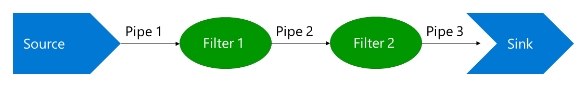

# Exercise 2

These exercises are meant to get you familiar with basic PowerShell concepts and syntax.

Tips to maximise your learning:

- Type *everything* by hand - don't copy paste.
- Examine each command/line as you type it - try to guess what it does and confirm/check with `[Enter]`.
- Don't skip anything.

## Nesting Commands

```powershell
Get-EventLog Security -Computer Server-R2,DC4,Files02
Get-EventLog Security -Computer 'Server-R2','Files02'
Get-EventLog Security -Computer 'Server-R2,Files01'
```

Create a text file with the following content:

```txt
Server-R2
Files02
Files03
DC04
DC03
```

Save it as `names.txt`.

```powershell
Get-EventLog Application -Computer (Get-Content names.txt)
```

## Piping Commands

PowerShell is built around the "Pipe and Filter" architectural pattern.



The idea is to follow these steps:

1. Get data
2. Filter/transform data 1
3. Filter/transform data 2
4. Save data

Any step except 1 can be considered optional.

### Examine this script

```powershell
Get-ChildItem -Filter *.jpg |
Where-Object LastWriteTime -lt "2015-01-01" |
Remove-Item
```

What does it do?
Modify script to work in your environment and run it!

### Examine this script (requires AD)

```powershell
Get-ADUser -Filter 'Name -like "*SvcAccount"' |
Select-Object Name, SamAccountName, SID |
Export-Csv "users.csv" –NoTypeInformation – Delimiter ";"
```

What does it do?
Modify script to work in your environment and run it!
